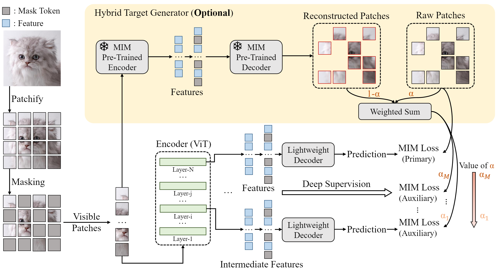

# DeepMIM 

## 🎉DeepMIM is accepted by WACV2025 as oral presentation!

## Introduction
This repository is the official implementation of our 

**DeepMIM: Deep Supervision for Masked Image Modeling** 

[[arxiv](https://arxiv.org/abs/2303.08817)] [[code](https://github.com/OliverRensu/DeepMIM)]

*[Sucheng Ren](https://oliverrensu.github.io/), [Fangyun Wei](https://scholar.google.com/citations?user=-ncz2s8AAAAJ&hl=en), [Samuel Albanie](https://samuelalbanie.com/), [Zheng Zhang](https://stupidzz.github.io/), [Han Hu](https://ancientmooner.github.io/)*

> Deep supervision, which involves extra supervisions to the intermediate features of a neural network, was widely used in image classification in the early deep learning era since it significantly reduces the training difficulty and eases the optimization like avoiding gradient vanish over the vanilla training. Nevertheless, with the emergence of normalization techniques and residual connection, deep supervision in image classification was gradually phased out. In this paper, we revisit deep supervision for masked image modeling (MIM) that pre-trains a Vision Transformer (ViT) via a mask-and-predict scheme. Experimentally, we find that deep supervision drives the shallower layers to learn more meaningful representations, accelerates model convergence, and expands attention diversities. Our approach, called DeepMIM, significantly boosts the representation capability of each layer. In addition, DeepMIM is compatible with many MIM models across a range of reconstruction targets.



## News
* Code and checkpoints are released!
## Installation
We build the repo based on [MAE](https://github.com/facebookresearch/mae)

## Pretraining
We pretrain DeepMIM on 32 V100 GPU with overall batch size of 4096 which is identical to that in MAE.
```
python -m torch.distributed.launch \
--nnodes 4 --node_rank $noderank \
--nproc_per_node 8 --master_addr $ip --master_port $port \
main_pretrain.py \
    --batch_size 128 \
    --model mae_vit_base_patch16 \
    --norm_pix_loss --clip_path /path/to/clip \
    --mask_ratio 0.75 \
    --epochs 1600 \
    --warmup_epochs 40 \
    --blr 1.5e-4 --weight_decay 0.05 \
    --data_path /path/to/imagenet/
```

## Fine-tuning on ImageNet-1K (Classification)
Expected results: 85.6% Top-1 Accuracy [log](./log/FT-log.txt)
```
python -m torch.distributed.launch --nproc_per_node=8 main_finetune.py \
    --batch_size 128 \
    --model vit_base_patch16 \
    --finetune ./output_dir/checkpoint-1599.pth \
    --epochs 100 \
    --output_dir ./out_finetune/ \
    --blr 1e-4 --layer_decay 0.6 \
    --weight_decay 0.05 --drop_path 0.1 --reprob 0.25 --mixup 0.8 --cutmix 1.0 \
    --dist_eval --data_path /path/to/imagenet
```

## Fune-tuning on ADE20K (Semantic Segmentation)
Please refer [Segmentation/README.md](./Segmentation/README.md)

## Checkpoint
The pretrained and finetuned model on ImageNet-1K are available at 

[[Google Drive](https://drive.google.com/drive/folders/1VLJX93RTnCLvIThLxmp71eBsm41HP0sw?usp=sharing)]

## Comparison
Performance comparison on ImageNet-1K classification and ADE20K Semantic Segmentation. 
|Method|Model Size| Top-1 | mIoU|
|---|:---:|:---:|:---:|
|MAE|ViT-B| 83.6| 48.1|
|DeepMIM-CLIP|ViT-B| 85.6 | 53.1|


## Citation

If you have any question, feel free to contact [Sucheng Ren](oliverrensu@gmail.com) :)
```
@inproceedings{ren2025deepmim,
  title={Deepmim: Deep supervision for masked image modeling},
  author={Ren, Sucheng and Wei, Fangyun and Zhang, Zheng and Albanie, Samuel  and Hu, Han},
  booktitle={2025 IEEE/CVF Winter Conference on Applications of Computer Vision (WACV)},
  pages={879--888},
  year={2025},
  organization={IEEE}
}
```